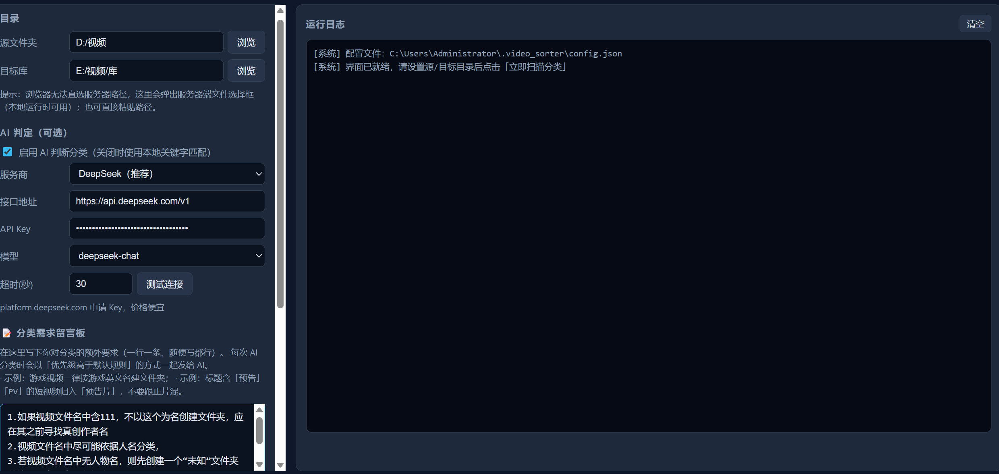

# 🎬 VideoSorter Web

> 一个用 Python 写的本地视频自动分类工具，浏览器操作界面，零第三方依赖。
> A local video auto-sorting tool with a browser UI, zero third-party dependencies.

[](https://github.com/<你的用户名>/video-sorter-web/releases)
[](LICENSE)
[](https://www.python.org/)

---

## ✨ 特性

- 🚀 **零依赖**：纯 Python 标准库，`pip install` 什么都不用装
- 🌐 **Web 界面**：启动后自动打开浏览器，像用网页一样管理视频
- 🤖 **AI 智能分类**：支持 DeepSeek / 通义千问 / 智谱 / 硅基流动 / Kimi / OpenAI / Ollama / 任意 OpenAI 兼容接口
- 📝 **分类需求留言板**：写下你的分类规则，AI 会严格遵守（比在代码里硬编码友好得多）
- 👁 **监控模式**：源目录一有新文件落地，自动分类
- 🧪 **演练模式**：先看清楚会怎么分类，再决定是否真动手
- 📂 **源/目标自由选择**：不绑定任何固定目录结构
- 💾 **配置持久化**：所有设置自动保存到本地 `config.json`

---

## 📸 界面预览



---

## 🚀 快速开始

### 方式一：下载 EXE（Windows 用户推荐）

去 [Releases](https://github.com/<你的用户名>/video-sorter-web/releases) 下载最新版 `VideoSorter.exe`，**双击运行**即可。

> ⚠️ 首次运行 Windows Defender 可能提示"未知发布者"，这是 PyInstaller 单文件打包的常见误报。点击"更多信息 → 仍要运行"即可。若有疑虑，请自行下载源码运行（见下方方式二）。

### 方式二：从源码运行（跨平台）

需要 Python 3.8+：

```bash
git clone https://github.com/<你的用户名>/video-sorter-web.git
cd video-sorter-web
python src/video_sorter_web.py